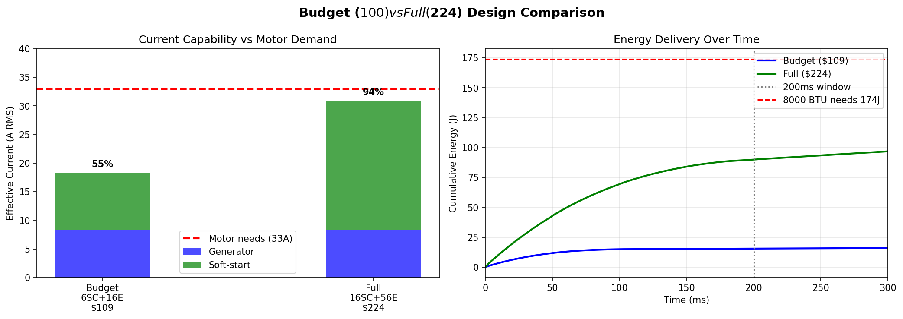

# Design Documentation

This folder contains the design evolution and analysis work that led to the final supercap-only design.

## Design Evolution

See [design_evolution.md](design_evolution.md) for the complete exploration of:
- Multi-tier LiPo battery approaches (rejected)
- Hybrid supercap + electrolytic stacking (explored, rejected for complexity)
- Supercap-only with PWM (selected)

## Analysis Scripts

The `/src` folder contains Python scripts used to analyze different configurations:

| Script | Purpose |
|--------|---------|
| `analyze_supercap_configs.py` | Supercap-only power delivery analysis |
| `analyze_hybrid_stacking.py` | Hybrid supercap + electrolytic concept |
| `analyze_motor_startup.py` | Motor startup current requirements |
| `analyze_phase_coverage.py` | Phase alignment with inductive loads |
| `analyze_12f_design.py` | Final 12F supercap design analysis |
| `analyze_budget_design.py` | Budget constraint optimization |
| `analyze_sourcing.py` | Component sourcing options |
| `comprehensive_analysis.py` | Combined capability assessment |

## Analysis Plots

| Plot | Description |
|------|-------------|
|  | Current requirements for different AC unit sizes |
|  | How injection aligns with motor current |
|  | Final 12F design options |
|  | Cost vs performance trade-offs |

## Key Findings

### Motor Startup Requirements

| AC Unit | Energy Needed (200ms) | Can Start with 60-cell design? |
|---------|----------------------|--------------------------------|
| 5000 BTU | ~77J | ✓ High confidence |
| 6000 BTU | ~108J | ✓ High confidence |
| 8000 BTU | ~174J | ✓ Medium confidence |
| 10000 BTU | ~241J | ? Marginal |

### Phase Alignment Advantage

Motor current lags voltage by ~70° at locked rotor (power factor ≈ 0.35). This means:
- Peak motor current occurs near voltage zero-crossing
- Our injection window (|V_ac| < 81V) includes zero-crossing
- We inject maximum current exactly when motor needs it most
- The 32% coverage captures the *critical* 32% of the AC cycle

### Why Supercap-Only Won

| Factor | Hybrid | Supercap-Only |
|--------|--------|---------------|
| Cost | $140-224 | **$85** |
| Complexity | High (8+ switches) | **Low (2 switches)** |
| Control | MCU required | Simple analog possible |
| Failure modes | Many | **Few** |
| Energy/200ms | 206J | 110J |

The hybrid delivers more energy, but the supercap-only design delivers similar *power* during the critical window at half the cost and complexity.
